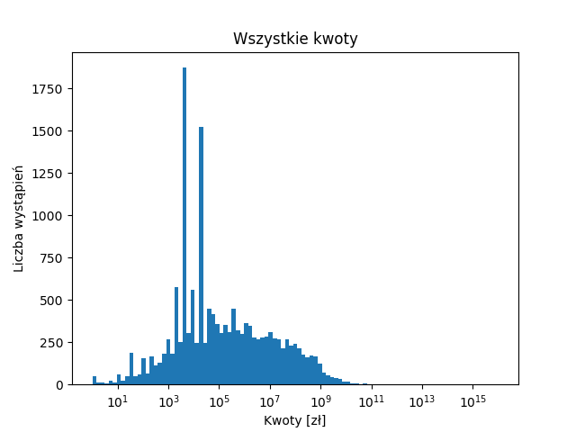
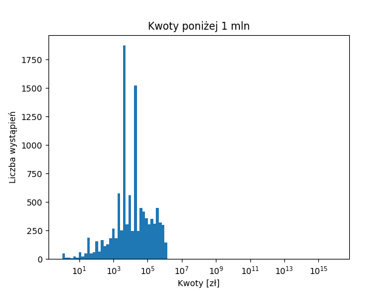
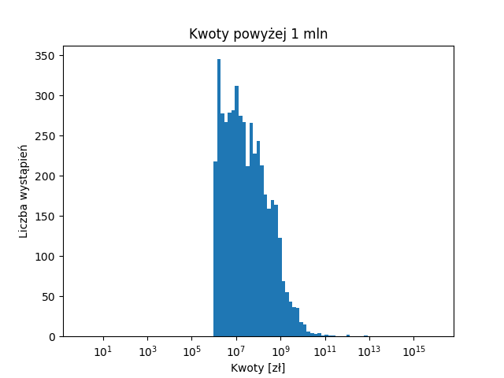

## Zadanie 1

## Zadanie 2

## Zadanie 3
W 2008 roku znaleziono 39 orzeczeń nawiązujących do art. 445 ustawy z dnia 23 kwietnia 1964 r. - Kodeks cywilny

## Zadanie 4
W 2008 roku znaleziono 829 orzeczeń zawierających słowo szkoda w dowolnej formie fleksyjnej.

