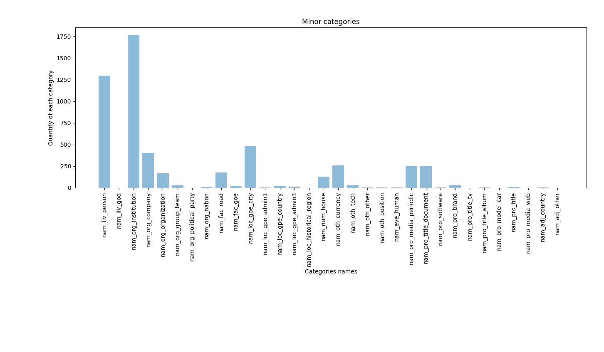
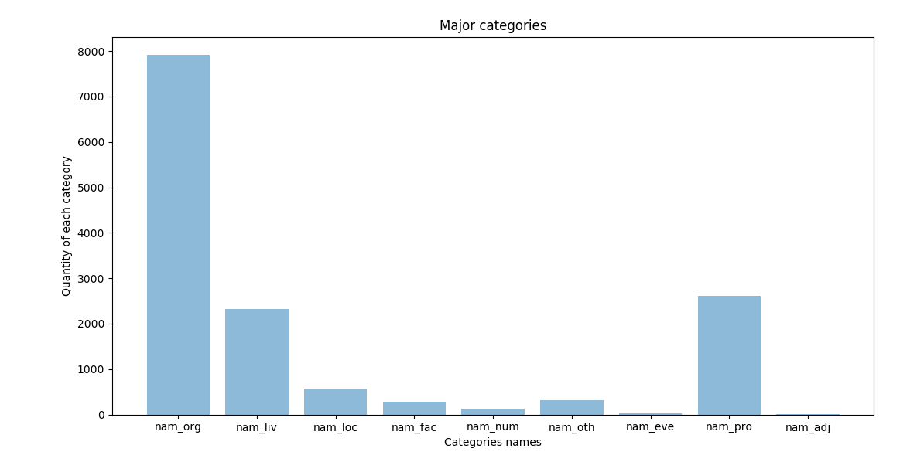

## Histogram dla podkategorii

```
nam_org_institution: 4619
nam_org_company: 2862
nam_org_organization: 382
nam_org_group_team: 48
nam_org_political_party: 1
nam_org_nation: 7
nam_liv_person: 2328
nam_liv_god: 1
nam_loc_gpe_city: 522
nam_loc_gpe_admin1: 4
nam_loc_gpe_country: 28
nam_loc_gpe_admin3: 12
nam_loc_historical_region: 1
nam_fac_road: 205
nam_fac_goe: 71
nam_num_house: 131
nam_oth_currency: 260
nam_oth_tech: 35
nam_oth_other: 6
nam_oth_position: 9
nam_eve_human: 20
nam_pro_media_periodic: 897
nam_pro_title_document: 1618
nam_pro_software: 3
nam_pro_brand: 60
nam_pro_title_tv: 2
nam_pro_title_album: 4
nam_pro_model_car: 3
nam_pro_title: 19
nam_pro_media_web: 1
nam_adj_country: 4
nam_adj_other: 1
```




## Histogram dla kategorii

```
nam_org: 7919
nam_liv: 2329
nam_loc: 567
nam_fac: 276
nam_num: 131
nam_oth: 310
nam_eve: 20
nam_pro: 2607
nam_adj: 5
```




## 100 najczęściej rozpoznanych wyrażeń, wraz z liczbą ich wystąpień oraz kategorią semantyczną

```
[('.', 'nam_org_company', 725),
 ('Sąd', 'nam_org_institution', 512),
 ('Sądu', 'nam_org_institution', 424),
 ('.', 'nam_pro_media_periodic', 421),
 ('o', 'nam_org_company', 316),
 ('zł', 'nam_oth_currency', 228),
 ('Dz', 'nam_pro_media_periodic', 213),
 ('U', 'nam_pro_media_periodic', 211),
 ('Sp', 'nam_org_company', 210),
 ('Najwyższy', 'nam_org_institution', 196),
 ('Zamawiającego', 'nam_liv_person', 165),
 ('z', 'nam_org_company', 161),
 ('.', 'nam_liv_person', 152),
 ('Publicznych', 'nam_org_institution', 135),
 ('Apelacyjny', 'nam_org_institution', 133),
 ('Urzędu', 'nam_org_institution', 131),
 ('S', 'nam_org_company', 130),
 ('Zamówień', 'nam_org_institution', 127),
 ('o', 'nam_pro_title_document', 121),
 ('Okręgowego', 'nam_org_institution', 119),
 ('Polska', 'nam_org_company', 117),
 ('Najwyższego', 'nam_org_institution', 114),
 ('A', 'nam_org_company', 113),
 ('Okręgowy', 'nam_org_institution', 109),
 ('w', 'nam_org_institution', 109),
 ('ustawy', 'nam_pro_title_document', 107),
 ('Zamawiający', 'nam_liv_person', 105),
 ('z', 'nam_pro_title_document', 94),
 ('Prawo', 'nam_pro_title_document', 93),
 ('publicznych', 'nam_pro_title_document', 90),
 ('Apelacyjnego', 'nam_org_institution', 88),
 ('zamówień', 'nam_pro_title_document', 85),
 ('Warszawa', 'nam_loc_gpe_city', 83),
 ('dnia', 'nam_pro_title_document', 82),
 ('Ubezpieczeń', 'nam_org_institution', 75),
 ('Odwołującego', 'nam_liv_person', 74),
 ('Społecznych', 'nam_org_institution', 73),
 ('Najwyższy', 'nam_liv_person', 68),
 ('r', 'nam_pro_title_document', 68),
 ('.', 'nam_pro_title_document', 68),
 ('Rejonowego', 'nam_org_institution', 65),
 ('Państwa', 'nam_org_institution', 65),
 ('Warszawie', 'nam_loc_gpe_city', 57),
 ('i', 'nam_org_institution', 54),
 ('Prezesa', 'nam_org_institution', 53),
 ('Comesa', 'nam_org_company', 53),
 ('Diagnostics', 'nam_org_company', 52),
 ('Roche', 'nam_org_company', 51),
 ('Izbie', 'nam_org_institution', 50),
 ('Pracy', 'nam_org_institution', 50),
 ('-', 'nam_org_institution', 48),
 ('TK', 'nam_org_institution', 43),
 ('Trybunał', 'nam_org_institution', 42),
 ('Konstytucyjny', 'nam_org_institution', 42),
 ('Cywilnej', 'nam_org_institution', 41),
 ('S', 'nam_liv_person', 40),
 ('Krajowa', 'nam_org_institution', 39),
 ('Izba', 'nam_org_institution', 37),
 ('Odwoławcza', 'nam_org_institution', 37),
 ('J', 'nam_liv_person', 37),
 ('Sądowi', 'nam_org_institution', 35),
 ('Skarbu', 'nam_org_institution', 34),
 ('Odwołujący', 'nam_liv_person', 34),
 ('Trybunału', 'nam_org_institution', 33),
 ('Konstytucyjnego', 'nam_org_institution', 32),
 ('grudnia', 'nam_pro_title_document', 32),
 ('Rejonowy', 'nam_org_institution', 31),
 ('-', 'nam_liv_person', 30),
 ('M', 'nam_liv_person', 30),
 ('Rady', 'nam_org_institution', 29),
 ('Krajowej', 'nam_org_institution', 29),
 ('Ministrów', 'nam_org_institution', 28),
 ('Przedsiębiorstwo', 'nam_org_company', 27),
 ('-', 'nam_org_company', 27),
 ('Skarb', 'nam_org_institution', 26),
 ('K', 'nam_liv_person', 26),
 ('i', 'nam_org_company', 25),
 ('”', 'nam_org_company', 24),
 ('Zbigniew', 'nam_liv_person', 24),
 ('Konsorcjum', 'nam_org_company', 23),
 ('Protokolant', 'nam_liv_person', 23),
 ('B', 'nam_liv_person', 22),
 (',', 'nam_org_company', 21),
 ('„', 'nam_org_company', 21),
 ('PLN', 'nam_oth_currency', 21),
 ('i', 'nam_pro_title_document', 21),
 ('Zakładu', 'nam_org_institution', 20),
 ('Marek', 'nam_liv_person', 20),
 ('cywilnego', 'nam_pro_title_document', 20),
 ('postępowania', 'nam_pro_title_document', 20),
 ('zmianie', 'nam_pro_title_document', 20),
 ('C', 'nam_org_organization', 19),
 ('Zamawiającemu', 'nam_liv_person', 19),
 ('Sądem', 'nam_org_institution', 18),
 ('Kasy', 'nam_org_institution', 18),
 (':', 'nam_org_company', 18),
 ('"', 'nam_org_company', 18),
 ('Magdalena', 'nam_liv_person', 18),
 ('Izby', 'nam_loc_gpe_city', 18),
 ('w', 'nam_pro_title_document', 18)]
```

## 10 najczęstszych wyrażeń, dla każdej wysokopoziomowej (zgrubnej) klasy wyrażeń

```
Top 10 for nam_org:
[('.', 725),
 ('Sąd', 512),
 ('Sądu', 424),
 ('o', 316),
 ('Sp', 210),
 ('Najwyższy', 196),
 ('z', 161),
 ('Publicznych', 135),
 ('Apelacyjny', 133),
 ('Urzędu', 131)]
************************* 

Top 10 for nam_liv:
[('Zamawiającego', 165),
 ('.', 152),
 ('Zamawiający', 105),
 ('Odwołującego', 74),
 ('Najwyższy', 68),
 ('S', 40),
 ('J', 37),
 ('Odwołujący', 34),
 ('-', 30),
 ('M', 30)]
************************* 

Top 10 for nam_loc:
[('Warszawa', 83),
 ('Warszawie', 57),
 ('Izby', 18),
 ('Katowicach', 17),
 ('Tarnów', 14),
 ('Tarnowie', 13),
 ('Krakowie', 12),
 ('Katowice', 9),
 ('Lublinie', 9),
 ('Zabrze', 9)]
************************* 

Top 10 for nam_fac:
[('Stawki', 10),
 ('Fabryczna', 8),
 ('Wolińska', 7),
 ('Wybrzeże', 7),
 ('Gdyńskie', 7),
 ('Armii', 7),
 ('Krajowej', 7),
 ('Leśna', 7),
 ('Macedońskiej', 6),
 ('Budowlana', 5)]
************************* 

Top 10 for nam_num:
[('4', 17),
 ('1', 11),
 ('2', 10),
 ('38', 7),
 ('41', 6),
 ('6', 6),
 ('12', 5),
 ('26', 5),
 ('7', 5),
 ('10', 5)]
************************* 

Top 10 for nam_oth:
[('zł', 228),
 ('PLN', 21),
 ('złotych', 10),
 ('VAT', 8),
 ('C', 8),
 ('Internet', 6),
 ('VAT', 5),
 ('VIII', 3),
 ('DM', 3),
 ('Prezes', 3)]
************************* 

Top 10 for nam_eve:
[('Elektronicznego', 2),
 ('Katalogu', 2),
 ('Dokumentów', 2),
 ('Spółek', 2),
 ('Modernizacja', 1),
 ('Systemu', 1),
 ('Bezpieczeństwa', 1),
 ('śywności', 1),
 ('–', 1),
 ('SBś', 1)]
************************* 

Top 10 for nam_pro:
[('.', 421),
 ('Dz', 213),
 ('U', 211),
 ('o', 121),
 ('ustawy', 107),
 ('z', 94),
 ('Prawo', 93),
 ('publicznych', 90),
 ('zamówień', 85),
 ('dnia', 82)]
************************* 

Top 10 for nam_adj:
[('polskim', 1),
 ('francuskiego', 1),
 ('niemieckiego', 1),
 ('polską', 1),
 ('internetowych', 1)]
************************* 
```
