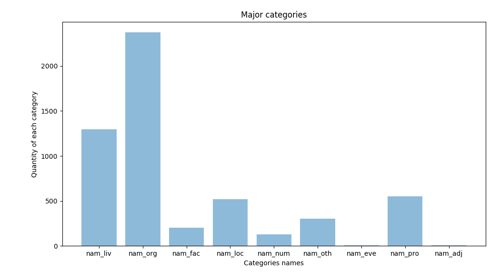

## Histogram dla podkategorii

```
nam_liv_person: 1294
nam_liv_god: 1
nam_org_institution: 1765
nam_org_company: 405
nam_org_organization: 169
nam_org_group_team: 26
nam_org_political_party: 1
nam_org_nation: 7
nam_fac_road: 179
nam_fac_goe: 24
nam_loc_gpe_city: 484
nam_loc_gpe_admin1: 4
nam_loc_gpe_country: 20
nam_loc_gpe_admin3: 12
nam_loc_historical_region: 1
nam_num_house: 131
nam_oth_currency: 259
nam_oth_tech: 33
nam_oth_other: 6
nam_oth_position: 4
nam_eve_human: 5
nam_pro_media_periodic: 254
nam_pro_title_document: 248
nam_pro_software: 3
nam_pro_brand: 31
nam_pro_title_tv: 1
nam_pro_title_album: 2
nam_pro_model_car: 1
nam_pro_title: 8
nam_pro_media_web: 1
nam_adj_country: 4
nam_adj_other: 1
```


## Histogram dla kategorii

```
nam_liv: 1295
nam_org: 2373
nam_fac: 203
nam_loc: 521
nam_num: 131
nam_oth: 302
nam_eve: 5
nam_pro: 549
nam_adj: 5
```




## 100 najczęściej rozpoznanych wyrażeń, wraz z liczbą ich wystąpień oraz kategorią semantyczną

```
[('sąd najwyższy', 'nam_org_institution', 318),
 ('zamawiać', 'nam_liv_person', 286),
 ('złoty', 'nam_oth_currency', 237),
 ('sąd apelacyjny', 'nam_org_institution', 188),
 ('sąd okręgowy', 'nam_org_institution', 159),
 ('Warszawa', 'nam_loc_gpe_city', 145),
 ('dziennik . u .', 'nam_pro_media_periodic', 145),
 ('odwoływać', 'nam_liv_person', 109),
 ('najwyższy', 'nam_liv_person', 86),
 ('urząd zamówienie publiczny', 'nam_org_institution', 85),
 ('trybunał konstytucyjny', 'nam_org_institution', 83),
 ('prawo zamówienie publiczny', 'nam_pro_title_document', 81),
 ('sąd rejonowy', 'nam_org_institution', 66),
 ('Dzieje_(Apostolskie) . u .', 'nam_pro_media_periodic', 63),
 ('skarb państwo', 'nam_org_institution', 59),
 ('krajowy izba odwoławczy', 'nam_org_institution', 44),
 ('TK', 'nam_org_institution', 43),
 ('izba cywilny', 'nam_org_institution', 40),
 ('prezes urząd zamówienie publiczny', 'nam_org_institution', 39),
 ('Tarnowo', 'nam_loc_gpe_city', 27),
 ('Katowice', 'nam_loc_gpe_city', 26),
 ('wykonawca', 'nam_liv_person', 25),
 ('Comesa Polska spółka', 'nam_org_company', 23),
 ('Roche Diagnostics Polska spółka . z o . o .', 'nam_org_company', 22),
 ('nowy_polski_złoty', 'nam_oth_currency', 21),
 ('Roche Diagnostics Polska spółka', 'nam_org_company', 18),
 ('izba', 'nam_loc_gpe_city', 18),
 ('spółka', 'nam_liv_person', 17),
 ('sąd okręgowy - sąd praca i ubezpieczenie społeczny',
  'nam_org_institution',
  17),
 ('zakład ubezpieczenie społeczny', 'nam_org_institution', 17),
 ('Comesa Polska spółka . z o . o .', 'nam_org_company', 17),
 ('C', 'nam_org_organization', 17),
 ('Krak', 'nam_loc_gpe_city', 17),
 ('Lublin', 'nam_loc_gpe_city', 17),
 ('4', 'nam_num_house', 17),
 ('Al', 'nam_liv_person', 16),
 ('imienie rzeczpospolita polski dzień', 'nam_org_institution', 16),
 ('sąd dyscyplinarny', 'nam_org_institution', 15),
 ('Karol k .', 'nam_liv_person', 14),
 ('rad minister', 'nam_org_institution', 14),
 ('kodeks postępowanie cywilny', 'nam_pro_title_document', 14),
 ('prokurator generalny', 'nam_org_institution', 13),
 ('Zabrze', 'nam_loc_gpe_city', 13),
 ('ustawa z dzień 15 grudzień 2000 r . o spółdzielnia mieszkaniowy',
  'nam_pro_title_document',
  13),
 ('Jacek Wieczorek', 'nam_liv_person', 12),
 ('kasa krajowy', 'nam_org_institution', 12),
 ('XXX', 'nam_org_organization', 12),
 ('Gliwice', 'nam_loc_gpe_city', 12),
 ('Łódź', 'nam_loc_gpe_city', 12),
 ('ARPOL', 'nam_pro_media_periodic', 12),
 ('Jan Paweł II', 'nam_liv_person', 11),
 ('M', 'nam_liv_person', 11),
 ('Dariusz sekunda .', 'nam_liv_person', 11),
 ('kasa krajowy', 'nam_liv_person', 11),
 ('Edward Solak', 'nam_liv_person', 11),
 ('sąd', 'nam_org_institution', 11),
 ('M', 'nam_org_organization', 11),
 ('1', 'nam_num_house', 11),
 ('skarżący', 'nam_liv_person', 10),
 ('Marek bajt .', 'nam_liv_person', 10),
 ('prezes rad minister', 'nam_org_institution', 10),
 ('fundusz ubezpieczenie społeczny', 'nam_org_institution', 10),
 ('macedoński', 'nam_fac_road', 10),
 ('stawek', 'nam_fac_road', 10),
 ('2', 'nam_num_house', 10),
 ('sąd apelacyjny – sąd dyscyplinarny', 'nam_org_institution', 9),
 ('ZUS', 'nam_org_institution', 9),
 ('sąd okręgowy w k', 'nam_org_institution', 9),
 ('unia europejski', 'nam_org_organization', 9),
 ('Częstochowa', 'nam_loc_gpe_city', 9),
 ('Magdalena Pazura', 'nam_liv_person', 8),
 ('protestujący', 'nam_liv_person', 8),
 ('Piotr Ś', 'nam_liv_person', 8),
 ('urząd skarbowy', 'nam_org_institution', 8),
 ('sąd okręgowy w o', 'nam_org_institution', 8),
 ('wojewódzki sąd administracyjny', 'nam_org_institution', 8),
 ('VAT', 'nam_org_organization', 8),
 ('fabryczny', 'nam_fac_road', 8),
 ('VAT', 'nam_oth_tech', 8),
 ('C', 'nam_oth_tech', 8),
 ('Netia sekunda', 'nam_pro_brand', 8),
 ('Magdalena Sierakowska', 'nam_liv_person', 7),
 ('Dariusz Zawistowski', 'nam_liv_person', 7),
 ('VIII', 'nam_liv_person', 7),
 ('Hubert L', 'nam_liv_person', 7),
 ('VAT', 'nam_org_institution', 7),
 ('izba praca', 'nam_org_institution', 7),
 ('ubezpieczenie społeczny i sprawa publiczny', 'nam_org_institution', 7),
 ('sąd okręgowy w w', 'nam_org_institution', 7),
 ('Budimex Dromex sekunda . a .', 'nam_org_company', 7),
 ('fundacja fundusz współpraca', 'nam_org_organization', 7),
 ('Wolińska', 'nam_fac_road', 7),
 ('wybrzeże gdyński', 'nam_fac_road', 7),
 ('armia krajowy', 'nam_fac_road', 7),
 ('leśna', 'nam_fac_road', 7),
 ('zamawiać', 'nam_loc_gpe_city', 7),
 ('Bytom', 'nam_loc_gpe_city', 7),
 ('Rzuchowej', 'nam_loc_gpe_city', 7),
 ('Gorzyce', 'nam_loc_gpe_city', 7),
 ('Polska', 'nam_loc_gpe_country', 7)]
```

## 10 najczęstszych wyrażeń, dla każdej wysokopoziomowej (zgrubnej) klasy wyrażeń

```
Top 10 for nam_liv:
[('zamawiać', 286),
 ('odwoływać', 109),
 ('najwyższy', 86),
 ('wykonawca', 25),
 ('spółka', 17),
 ('Al', 16),
 ('Karol k .', 14),
 ('Jacek Wieczorek', 12),
 ('Jan Paweł II', 11),
 ('M', 11)]
************************* 

Top 10 for nam_org:
[('sąd najwyższy', 318),
 ('sąd apelacyjny', 188),
 ('sąd okręgowy', 159),
 ('urząd zamówienie publiczny', 85),
 ('trybunał konstytucyjny', 83),
 ('sąd rejonowy', 66),
 ('skarb państwo', 59),
 ('krajowy izba odwoławczy', 44),
 ('TK', 43),
 ('izba cywilny', 40)]
************************* 

Top 10 for nam_fac:
[('macedoński', 10),
 ('stawek', 10),
 ('fabryczny', 8),
 ('Wolińska', 7),
 ('wybrzeże gdyński', 7),
 ('armia krajowy', 7),
 ('leśna', 7),
 ('budowlany', 5),
 ('Skowronek', 5),
 ('Łokietek', 5)]
************************* 

Top 10 for nam_loc:
[('Warszawa', 145),
 ('Tarnowo', 27),
 ('Katowice', 26),
 ('izba', 18),
 ('Krak', 17),
 ('Lublin', 17),
 ('Zabrze', 13),
 ('Gliwice', 12),
 ('Łódź', 12),
 ('Częstochowa', 9)]
************************* 

Top 10 for nam_num:
[('4', 17),
 ('1', 11),
 ('2', 10),
 ('38', 7),
 ('41', 6),
 ('6', 6),
 ('12', 5),
 ('26', 5),
 ('7', 5),
 ('10', 5)]
************************* 

Top 10 for nam_oth:
[('złoty', 237),
 ('nowy_polski_złoty', 21),
 ('VAT', 8),
 ('C', 8),
 ('Internet', 6),
 ('VAT', 5),
 ('VIII', 3),
 ('DM', 3),
 ('prezes SN', 3),
 ('złoty polski', 1)]
************************* 

Top 10 for nam_eve:
[('elektroniczny katalog dokument spółka', 2),
 ('modernizacja system bezpieczeństwo śywności – SBś II', 1),
 ('X - XII 2008', 1),
 ('spółka', 1)]
************************* 

Top 10 for nam_pro:
[('dziennik . u .', 145),
 ('prawo zamówienie publiczny', 81),
 ('Dzieje_(Apostolskie) . u .', 63),
 ('kodeks postępowanie cywilny', 14),
 ('ustawa z dzień 15 grudzień 2000 r . o spółdzielnia mieszkaniowy', 13),
 ('ARPOL', 12),
 ('Netia sekunda', 8),
 ('ustawa z dzień 1 sierpień 1997 r . o trybunał konstytucyjny', 7),
 ('konstytucja rzeczpospolita polski', 7),
 ('rozdział X', 7)]
************************* 

Top 10 for nam_adj:
[('polski', 2), 
 ('francuski', 1), 
 ('niemiecki', 1), 
 ('internetowy', 1)]
************************* 
```