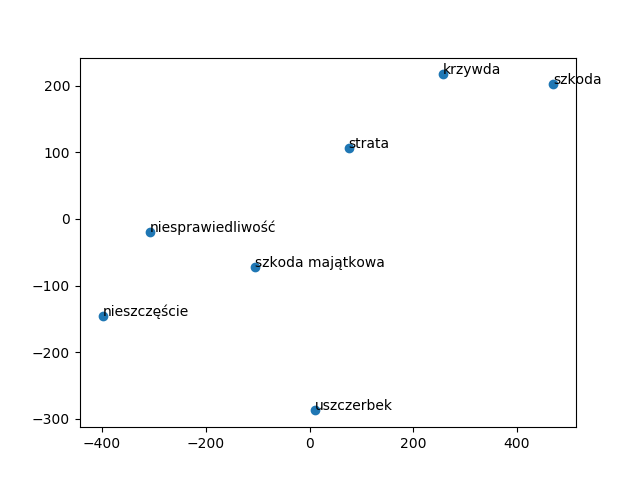

## 3 najbardziej podobne wyrażenia dla poniższych wyrażeń:

```
 Sąd Najwyższy
[('sądnajwyższy', 0.8144439458847046),
 ('sad_najwyższy', 0.7223759293556213),
 ('naczelny_sąd_administracyjny', 0.7020604014396667)]

 Trybunał Konstytucyjny
[('trybunał', 0.9166209697723389),
 ('naczelny_sąd_administracyjny', 0.7768865823745728),
 ('sądnajwyższy', 0.7652798891067505)]

 kodeks cywilny
[('kodeks_postępowania_cywilnego', 0.695941150188446),
 ('kodeks_karny', 0.6806467771530151),
 ('prawo_wekslowe', 0.6672903299331665)]

 kpk
[('kpc', 0.6648813486099243),
 ('k.pk', 0.6608846187591553),
 ('7_kpk', 0.6568803191184998)]

 sąd rejonowy
[('sad_rejonowy', 0.8729357719421387),
 ('sąd_pierwszej_instancji', 0.8196499943733215),
 ('sądrejonowy', 0.8145946860313416)]

 szkoda
[('szkoda_ta', 0.7611972093582153),
 ('szkoda_majątkowa', 0.748608410358429),
 ('krzywda', 0.7347034811973572)]

 wypadek
[('skutek', 0.5707592964172363),
 ('przypadek', 0.5529487133026123),
 ('przedmiotowy_wypadek', 0.5301172733306885)]

 kolizja
[('awaria', 0.6606889963150024),
 ('interwencja', 0.644267201423645),
 ('usterka', 0.6350970268249512)]

 szkoda majątkowa
[('krzywda', 0.7736622095108032),
 ('szkoda_ta', 0.7693728804588318),
 ('szkoda_niemajątkowa', 0.7655273675918579)]

 nieszczęście
[('usiadłem', 0.6587952375411987),
 ('aprobatę_zasługują_też', 0.6437283158302307),
 ('metycylinę', 0.635590672492981)]

 rozwód
[('rozwiązanie_małżeństwa', 0.6638490557670593),
 ('ustanowienie_rozdzielności_majątkowej', 0.6384871602058411),
 ('separację', 0.6342751383781433)]
```


## Wypadkowa operacji na słowach:

```
Sąd Najwyższy - kpc + konstytucja:
[('sąd_najwyższy', 0.7013203501701355),
 ('trybunał_konstytucyjny', 0.5891423225402832),
 ('sądnajwyższy', 0.5592589974403381),
 ('trybunał', 0.5523508787155151),
 ('sn', 0.5426117777824402)]

pasażer - mężczyzna + kobieta:
[('poszkodowana', 0.5456215143203735),
 ('kobieta', 0.49799901247024536),
 ('matka_powódki', 0.4844338297843933),
 ('kierująca', 0.47540655732154846),
 ('żona_powoda', 0.47328856587409973)]

samochód - droga + rzeka:
[('samochód', 0.7789424657821655),
 ('pojazd', 0.6793400645256042),
 ('towar', 0.584481954574585),
 ('przedmiotowy_samochód', 0.581882655620575),
 ('przedmiotowy_pojazd', 0.5790541172027588)]
```


## Projekcja wektorów na płaszczyznę:


